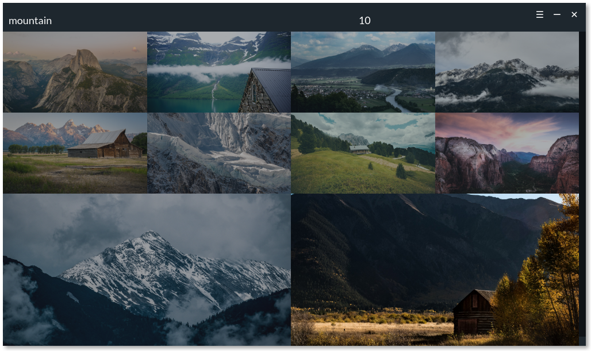

<h1 align="center">NewWall</h1>
<p align="center"><i>Just another wallpaper changing app!</i></p>
<p align="center"></p>

## About this project

NewWall is a side-project to refresh my Vue.js knowledge. I actually created the first version of this app and named it [Alluring](https://github.com/ZeroX-DG/Alluring). You can read more about how I created the first version of this app at [my blog](https://medium.com/the-z/the-making-of-a-wallpaper-changing-app-with-electron-and-vue-js-606e66b2a929).

## Develop

1. Clone this repo

```
git clone https://github.com/ZeroX-DG/NewWall.git
```

2. Fill in your unsplash API credentials in `config.example.js` and rename it to `config.js`
3. Install dependencies

```
npm i
```

4. Run the app

```
npm run dev
```

More info at [package.json](package.json)

## Author

- Hung Nguyen ([twitter](https://twitter.com/ZeroX_Hung))

## License

- [MIT](LICENSE)
